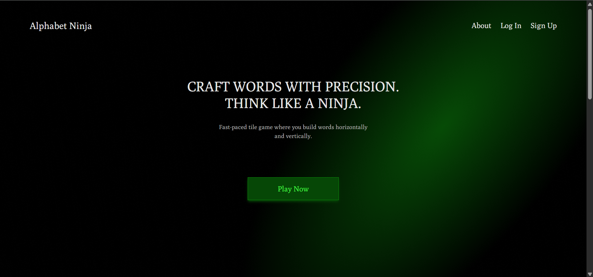
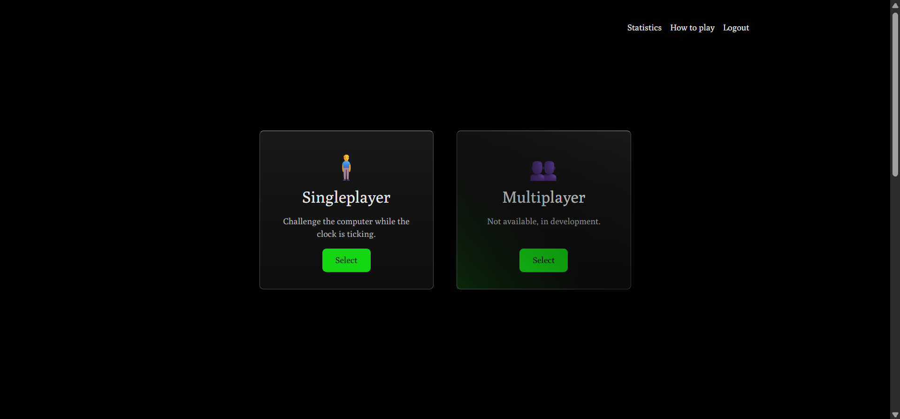
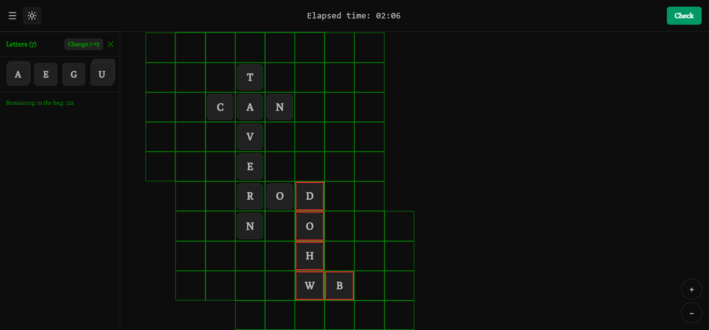
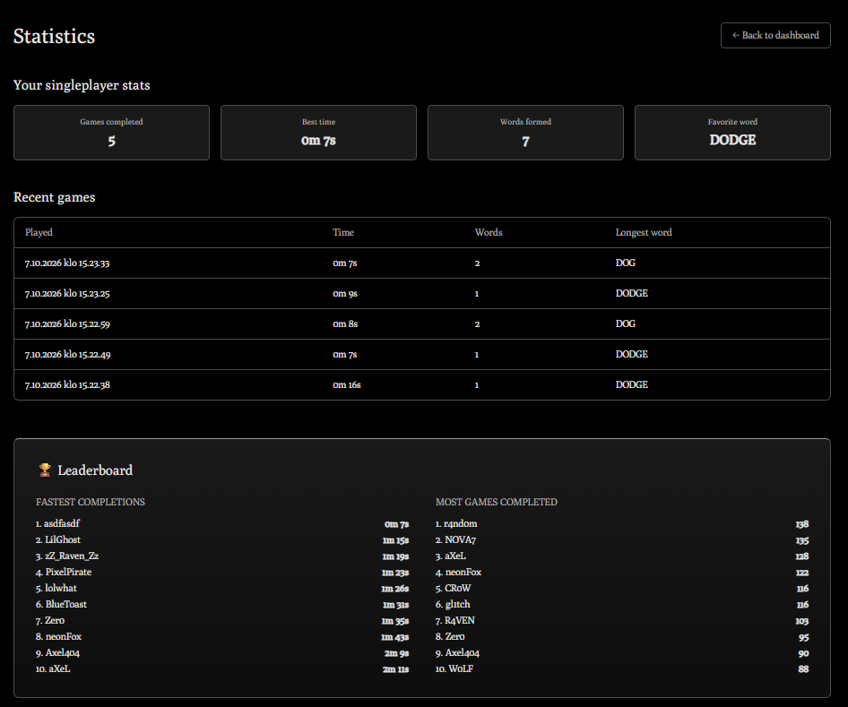

# Alphabet Ninja

A letter-tile word game. Build words horizontally and vertically. Drag tiles onto the board and build one connected chain of valid English words.

## Run:

You need [Docker](https://www.docker.com/products/docker-desktop/).

```bash
git clone https://github.com/lapazyygeli/letter-tile-game.git
cd letter-tile-game
docker compose up -d
```

Then open http://localhost:3000.

## Screenshots

**Landing page**



**Dashboard**



**Game.** After pressing Check, invalid words are outlined in red.



**How to play**


**Statistics**


